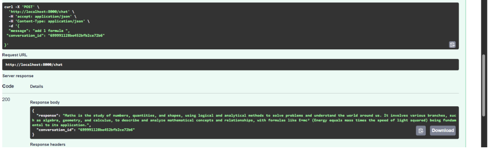

# Study Bot - AI Study Assistant

A chatbot that helps with study questions and remembers conversations using MongoDB.

## Features

- Answers academic questions using Groq AI
- Remembers conversation history
- REST API with FastAPI

## Tech Stack
- **Backend**: Python, FastAPI
- **Database**: MongoDB
- **AI**: Groq API
- **Deployment**: Local / (add if deployed)

## Setup

1. Clone repository
2. Create virtual environment: `python -m venv venv`
3. Activate it: `venv\Scripts\activate`
4. Install packages: `pip install -r requirements.txt`
5. Create .env file with your API keys
6. Run: `python main.py`
7. Visit `http://localhost:8000/docs`

## API Endpoints

- `GET /` - Welcome message
- `POST /chat` - Send a message
- `GET /conversation/{id}` - View conversation history

## 👨‍💻 Author
Zahra Khan - 3rd Semester Project
